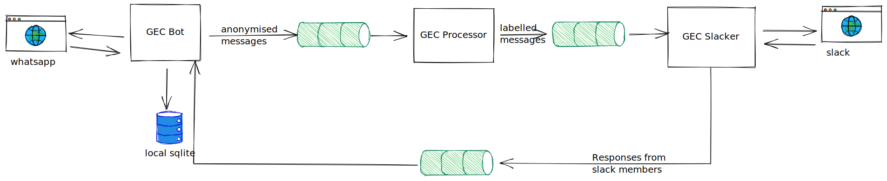

# Gender Equality Community Whatsapp Bot

The GEC Bot does two things:

1. It receives WhatsApp messages from people who want to talk to the GEC anonymously
2. It sends responses back to people anonymously too

## Anonymisation

Given a message sender from WhatsApp, we SHA256 that sender ID, and store that mapping in redis. We do this for two reasons:

1. We only share the sha downstream to avoid outing people
2. We kinda need to know which ID maps to which person for responding back

Because up until recently we only had the first concern (which is to say until recently we only sent messages one way and didn't allow for responses back via slack), so we only needed hashes.

## On Redis Streams

This application passes messages along via redis streams; these are lightweight, as quick as we need them, and can be run in cluster. This is important; by segregating as much as possible from the outside world/ outside users we can keep user data secure.

## Deployment

Deployments are manual for now.
